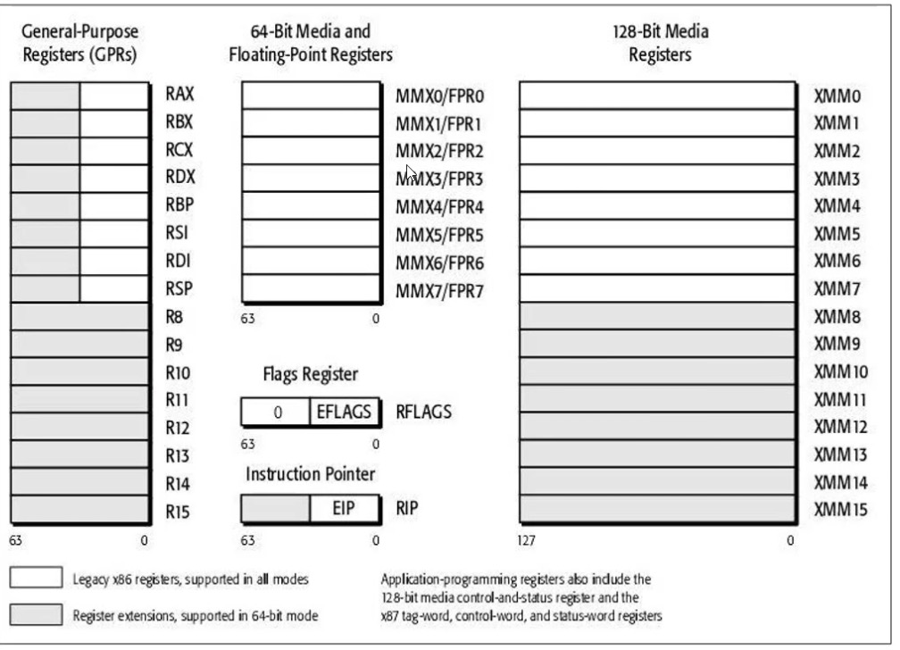
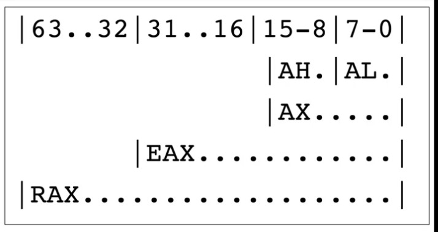

# C++


# 一、语法须知

## 1、源文件扩展名

- C++ 的源文件的扩展名是 `.cpp` , C++源文件的头文件的扩展名是`.hpp` 

  > - C 语言的源文件的扩展名是 `.c` , C语言的源文件的头文件的扩展名是`.h`
  >
  > - Objective-C的源文件的扩展名是`.m` , 对应的头文件的扩展名是`.h` , 如果在Objective-C中要使用C++ 的代码, 需要将`.m` 扩展明个改为`.mm` 表示在Objective-C中要用C++ 的代码
  >
  > - java 的源文件的扩展名时 `.java` 
  >
  > - javaScript 的源文件的扩展名是`.js` 

## 2、程序的入口

C++ 程序的入口是main函数, 与C语言的程序入口是一样的. 

```
// main.cpp
#include <iostream>
using namsspace std;

int main(){
	cout << "hello world!" << endl;
	return 0;
}
```


> 在不同的编程语言中, 程序的入口是不一样的, 比如在java 中, 是必须要先有类再有函数(方法) 的, 但是在C++ 中是与java不同的. 
>
> ```
> Main.java
> 
> public class Main{
> 	public static void main(String[] args){
> 		System.out.println("hello java");
> 	}
> }
> ```


## 3、C++ 完全兼容C语言语法

C++ 完全兼容C语言语法, 在很久以前, C++ 叫做 C with classes (即 有类的C语言)

其实,C++ 就是在C语言的基础上增加了类的特性


## 4、cin & cout

- C++ 中常用 `cin` & `cout` 进行控制台的输入 和 输出

  ````
  #include <iostream>			// 导入 cin cout 的头文件
  using namespace std;		// 标准命名空间 
  
  int main(){
  	int age;
  	cin >> age;
  	cout << "输入的age是: " << age << endl;
  	return 0;
  }
  
  // cout << "输入的age是: " << age << endl; 这句的写法与下面的写法完全等价
  // cout << "输入的age是: ";
  // cout << age;
  // cout << "\n";   
  // 即, endl 表示的就是输出一个换行
  ````

  > 注意: 
  >
  > 要使用C++ 的输入 输出  cin cout 必须导入头文件 `#include <iostream>` , 注意在导入C++ 的头文件时不要写成`iostream.h` 了, 是不需要 `.h` 的, 这样一点要特点注意


## 5、C++函数重载

### 1、C++ 函数重载的应用

C++ 支持函数重载, C语言不支持函数重载

```
#include <iostream>
using namespace std;


int sum(int a, int b){
    return a + b;
}

int sum(int a, int b, int c){
    return a + b + c;
}

int main(){
    
    // C++ 支持函数重载
    cout << sum(10, 10) << endl;
    cout << sum(10, 10, 10) << endl;
    return 0;
}
```

所谓函数重载, 就是方法名相同, 方法签名不同

**所谓的方法签名不同就是指, 方法的参数类型不同, 参数个数不同, 参数顺序不同, 函数的返回值类型与函数重载无关**


### 2、函数重载的二义性

**虽然C++支持函数重载, 但是我们时也要注意函数重载的二义性, 如下:**

```
#include <iostream>
using namespace std;

void display(double num){
    cout << "display double: " << num << endl;
}

void display(long num){
    cout << "display long: " << num << endl;
}

int main(){
    display(10);        // 编译错误, display 函数二义性, 因此此处 不确 10 的类型, 是隐式转换为 long 还是 double 不清楚
    display(10.0);
}
```


### 3、 函数重载的本质

C++ 支持函数名重载的本质是, C++底层采用的 `name mangling` 技术, 也叫做`name decoration` 技术

> 即, C++ 编译器默认会对符号名(比如: 函数名) 进行编译、修饰, 不同的C++ 编译器采用的 `name mangling` 命名规则可能不一样, 不过大致是这样的原理
>
> ```
> // 定义的 C++函数如下:
> void display(int num){
> 	cout << "display int: " << num << endl;
> }
> 
> void display(double num){
> 	cout << "display double: " << num << endl;
> }
> 
> 经过C++编译后, 上面两个函数名, 可能会变成下面这两个名字, 具体规则要看编译器
> display_int  display_double
> ```


## 6、默认参数

### 1、默认参数的使用

C++ 允许函数设置默认参数, 在调用时, 可以根据情况省略实参, 规则如下:

```
#include <iostream>
using namespace std;

// C++ 定义函数时, 可以设置默认参数
int sum(int a = 10, int b = 20){
    return a + b;
}

int main(){
    cout << sum(5, 10) << endl;
    cout << sum(5) << endl;
    cout << sum() << endl;
}
// 打印: 
15
25
30
```


### 2、默认参数的注意事项

- **当我们在给函数设置默认参数时, 如果函数有多个参数, 默认参数的位置必须从右边开始** 

  ```
  // 正确用法
  int sum(int a = 10, int b = 20){
      return a + b;
  }
  
  int sum(int a, int b = 20){
      return a + b;
  }
  
  // 错误用法, 
  int sum(int a = 10, int b){
      return a + b;
  }
  ```

- **如果函数同时有声明和实现, 默认参数只能放在函数的声明中**

  ```
  #include <iostream>
  using namespace std;
  
  // 函数声明, 此时, 默认参数只能写在声明里面
  int sum(int a = 10, int b = 20);
  
  // 函数实现
  int sum(int a, int b){
      return a + b;
  }
  
  int main(){
      cout << sum(5, 10) << endl;
      cout << sum(5) << endl;
      cout << sum() << endl;
      return 0;
  }
  ```

- **默认参数的值可以是常量、全局符号(全局变量、函数名)**

  ```
  #include <iostream>
  using namespace std;
  
  int age = 5; // 写在函数外面的变量就是全局变量
  
  // 函数声明
  int sum(int a = age, int b = 20);
  
  // 函数实现
  int sum(int a, int b){
      return a + b;
  }
  
  
  void test(){
      cout << "test" << endl;
  }
  
  // 默认参数可以是函数名
  void doTest(void (*pp)() = test){ // 参数是指向函数的指针
      pp();
  }
  
  
  
  
  int main(){
      
      doTest();
      
      cout << sum(5, 10) << endl;
      cout << sum(5) << endl;
      cout << sum() << endl;
      return 0;
  }
  ```

### 3、函数重载、默认参数可能产生冲突、二义性

> 建议优先选择使用默认参数(因为默认参数, 多一个参数功能多一点)

```
比如: 下面的函数是函数重载, 但是在实际使用过程中可能会出现冲突

void display(int a, int b = 20){
	cout << "display a: " << a << ", b: " << b << endl;
}

void display(int a){
	cout << "display a: " << a << endl;
}


int main(){
	display(10); // 错误, 这时编译器根本分不清, 是函数重载还是 默认参数, 
	return 0;
}
```


### 4、默认参数的本质

编译器在调用方法时帮我们传递了一个参数, 就是传的默认参数


## 7、extern "C" 重点!!!

### 1、extern "C" 修饰的代码特点

被 **extern "C"** 修饰的代码会按照C语言的方式去编译, 因此被 **extern "C"** 修饰的方法是不支持函数函数重载的, 如下: 

```
#include <iostream>
using namespace std;


extern "C"  void display(int a, int b){
    cout << "display int a: " << a <<  ", b: " << b << endl;
}
 
// 错误, 不支持重载, 因此被视为函数重复定义
//extern "C"  void display(double a, double b){
//    cout << "display double a: " << a <<  ", b: " << b << endl;
//}


int main(){
    display(10);
    return 0;
}

```

经过测试发现, 虽然被  **extern "C"** 修饰的代码只能按照C 语言的方式去编译, 但是默认参数还是允许被支持的, 如下:

```
// 下面的代码, 编译 和 运行 是能通过的
#include <iostream>
using namespace std;

extern "C"  void display(int a, int b = 18){
    cout << "display int a: " << a <<  ", b: " << b << endl;
}

int main(){
    display(10);
    return 0;
}
```


### 2、extern "C" 修饰代码的书写格式

- 方式1, 直接在 需要修饰的方法前面使用 **extern "C"** 修饰即可, 如下:

  ```
  extern "C"  void display(int a, int b = 18){
      cout << "display int a: " << a <<  ", b: " << b << endl;
  }
  ```

- 方式2, 使用 **extern "C"** 修饰一个代码块, 如下:

  ```
  // 表示整个代码块内的代码, 采用C语言的方式编译 
  extern "C" {
  	void display(int a){
  		cout << "display int a: " << a << endl;
  	}
  	
  	void func(){
  		cout << "test func" << endl;
  	}
  }
  ```

- 声明和实现分开的书写方式, 与上面两种等价

  ```
  extern "C"  void display(int a, int b = 18);
  void display(int a, int b = 18){
      cout << "display int a: " << a <<  ", b: " << b << endl;
  }
  
  extern "C" {
  	void display(int a);
  	void func();
  }
  void display(int a){
  	cout << "display int a: " << a << endl;
  }
  
  void func(){
  	cout << "test func" << endl;
  }
  ```

  

### 3、extern "C" 修饰代码 注意事项

- **如果函数同时有声明 和 实现, 要让函数声明 被 extern "C" 修饰, 函数的实现不能被 extern "C" 修饰.** 

  这个规则和默认参数的设置规则类似, 都是必须只作用在声明部分

  ```
  // 正确写法:
  extern "C" void display(int a, int b);
  
  void display(int a, int b){
      cout << "display int a: " << a <<  ", b: " << b << endl;
  }
   
   
  // 错误写法
  void display(int a, int b);
  
  extern "C" void display(int a, int b){
      cout << "display int a: " << a <<  ", b: " << b << endl;
  }
  ```


### 4、C  与 C++ 混合开发

由于C、C++ 编译规则的不同, 在进行C、C++混合开发时, 可能经常会出现下面的操作


我们在进行C++ 开发时, 通常可能会遇到这么一种情况, 就是我们在开发一个功能模块, 这个模块的代码在网上已经有了C语言版本的开源实现, 我们希望将C语言的开发实现直接拿到我们的C++ 项目中来用. 

我们知道C语言的编译规则和C++语言的编译规则是不一样的,  直接强行将`.c` 文件中定义的方法声明到`.cpp` 文件来使用, C++ 编译器在运行时会报找不到`.c` 源文件中声明的方法的, 因为我们直接强行将C语言中定义的方法名声明到C++ 文件中后, C++ 编译器在运行时, 是按照C++的规则来找方法的, 是找不到C语言中的方法的, 因此是没有直接在C++中使用C语言定义的方法的, 我们需要在引入C语言方法(声明C语言方法)是告诉C++ 编译器, 那一部分的方法是C语言实现的, 用C语言的规则来查找, 这样才能在C++ 中使用C语言实现的代码

> C语言的源文件的扩展名是`.c` 而C++语言的源文件的扩展名是 `.cpp` 

- 比如: 我们在`Math.c` 中实现了以下方法

  ```
  int sum(int a, int b){
      return a + b;
  }
  
  int delta(int a, int b){
      return a - b;
  }
  ```

- 我们在 `main.cpp` 文件中直接声明 `Math.c` 中定义的方法如下, 是不行的

  ```
  #include <iostream>
  using namespace std;
  
  // 在cpp 中, 直接声明C 中的方法, 是错误的
  int sum(int a, int b);
  int delta(int a, int b);
  
  int main(){
  
  		// 错, 报 sum 和 delta 方法找不到
      cout << "sum: " << sum(10,20) << endl;
      cout << "delta: " << delta(30,10) << endl;
      return 0;
  }
  ```

- 正确的方式应当是这样的

  ```
  #include <iostream>
  using namespace std;
  
  extern "C" int sum(int a, int b);
  extern "C"int delta(int a, int b);
  
  int main(){
  
  		// 错, 报 sum 和 delta 方法找不到
      cout << "sum: " << sum(10,20) << endl;
      cout << "delta: " << delta(30,10) << endl;
      return 0;
  }
  
  // 或者下面这样
  #include <iostream>
  using namespace std;
  
  extern "C" {
  	int sum(int a, int b);
  	int delta(int a, int b);
  }
  
  int main(){
  
  		// 错, 报 sum 和 delta 方法找不到
      cout << "sum: " << sum(10,20) << endl;
      cout << "delta: " << delta(30,10) << endl;
      return 0;
  }
  ```

  > 使用extern "C" 是告诉C++ 编译器, 这部分的代码 用C语言的方式实现的, 用C语言的方式来找和执行

## 8、 头文件

### 1、.h 文件的由来

从上面第 4 点, 我们发现, 当我们在C++ 源文件中需要用到其它源文件中的 方法时, 我们需要在调用方法前先声明有这些方法, 让后再调用, 每次都要拷贝很多方法的声明`比如: int sum(int a, int b); int delta(int a, int b);`  很麻烦, 因此我们在开发中 一般会将需要暴露给外部使用的方法声明, 在`.h` 文件中写一份, 这样外部在使用时就不用再每次使用前都单独的在拷贝一份, 直接只用`#include "xxx.h"` 文件将 代声明的方法导入即可

有了`.h` 文件, 我们以后在书写代码时方式就发现变化了, 如下: 是我们对 上面第4点 代码实现组织的改进

改进后如下:

- Math.c 文件的实现如下:

  ```
  int sum(int a, int b){
      return a + b;
  }
  
  int delta(int a, int b){
      return a - b;
  }
  ```

- Math.h 文件的实现如下:

  ```
  int sum(int a, int b);
  int delta(int a, int b);
  ```

- main.cpp 文件改进如下

  ```
  #include <iostream>
  using namespace std;
  
  extern "C"{ // 告诉 C++我们导入的文件内容采用C语言规则实现
  	#include "Math.h" 
  }
  
  int main(){
  
  		// 错, 报 sum 和 delta 方法找不到
      cout << "sum: " << sum(10,20) << endl;
      cout << "delta: " << delta(30,10) << endl;
      return 0;
  }
  ```

**换句话说, 如果你要在C++ 的项目中使用C语言实现的功能导入的C语言头文件, 需要写在 extern "C"  { } 的花括号内** 


### 2、 .h 文件内 声明函数名改进

- Math.h 文件的内改进为如下

  ```
  extern "C"{
    int sum(int a, int b);
    int delta(int a, int b);
  }
  ```

  改进后的代码, 就可以直接 在`.cpp` 文件内通过 `#include "Math.h" ` 文件使用了, 如下:

  ```
  #include <iostream>
  using namespace std;
  
  #include "Math.h" 
  
  int main(){
  
  		// 错, 报 sum 和 delta 方法找不到
      cout << "sum: " << sum(10,20) << endl;
      cout << "delta: " << delta(30,10) << endl;
      return 0;
  }
  ```

  改进后的C语言头文件虽然可以直接在`.cpp` 文件中通过 `#include "Math.h" `  导入使用了, 但是出现了一个新的问题就是不能在 `.c` 文件中通过 `#include "Math.h" `  导入来使用了, 因为 在`.c` 文件中是不认识 `extern "C"`  因此我们的 	`.h` 文件的书写方式还要再继续改进, 让 C++文件和C文件都可以直接导入使用, 如下:

- **改进后的Math.h 文件 书写格式如下:** 

  ```
  #ifdef __cplusplus
  extern "C"{
  #endif // __cplusplus
  
    int sum(int a, int b);
    int delta(int a, int b);
  
  
  #ifdef __cplusplus
  }
  #endif // __cplusplus
  ```

  在C++ 的环境内有个宏定义 `#define __cplusplus`, 只要是C++的环境就有这个宏定义

  使用条件宏定义来解决, 在C++的环境中 自动增加  extern "C"{ } 的问题

### 3、.h 文件书写的再改进

前面我们前面讲过 `.h` 在开发中完全是可以没有的.  在开发中`.h` 文件的功能是为了解决我们在`.c`  或者 `.cpp` 文件中声明方法的产物, `.h` 文件的作用就是方便我们 声明方法.

但是我们前面对`.h` 文件的书写改进, 仅仅解决的是`.h` 文件在 `.c` 文件中和 `.cpp` 文件中便利导入的问题, 但是没有解决同一个`.c`文件中或者`.cpp` 文件中 多次使用 `#include "xxx.h"` 导入同一个头文件的重复导入问题. 虽然在同一个文件中重复声明同一个函数是没有问题的, 但是我们在实际的开发中也是要避免这种重复声明的问题的. 

- 改进后的 `.h` 文件, 书写格式如下:

  ```
  Math.h 文件中的代码书写如下: 
  
  // 防止同一个头文件被 重复导入多次
  #ifndef Math_h
  #define Math_h
  
   
  // 根据编译环境是不是C++ 决定 要不要使用extern "C" 
  #ifdef __cplusplus
      extern "C" {
  #endif
      
      int sum(int a, int b);
      int delta(int a, int b);
      
  #ifdef __cplusplus
      }
  #endif
  
  #endif /* Math_h */
  ```

**通过 下面这种, 条件宏定义的处理后, 我们就能避免同一个头文件中的内容, 在同一个文件中被重复 导入的问题**

```
#ifndef Math_h
#define Math_h

#endif /* Math_h */
```


## 9、内联函数 (inline function)

### 1、什么是内联函数, 内联函数的特点

使用 **inline** 修饰函数的声明 或者 实现, 可以使其变成内联函数, 换句话说, 只要一个函数是被 inline 修饰的, 不论修饰的是函数的声明部分还是实现部分还是声明实现部分, 那么这个函数都是内联函数.如下:

````
// 下面三个函数都是内联函数
inline int sum(int a, int b);
int sum(int a, int b){
	return a + b;
}

int delta(int a, int b);
inline int delta(int a, int b){
	return a - b;
}

inline int multi(int a, int b){;
inline int multi(int a, int b){
	return a * b;
}
````


内联函数的特点:

- 被**inline** 修饰的函数我们称为内联函数

- 编译器会直接将内联函数的 **函数调用 直接展开为函数体**

  ```
  // 说白了, 相当于这样
  inline int sum(int a, int b){
  	return a + b;
  }
  
  int main(){
  	int rst = sum(10, 20);
  }
  
  // 等价于
  int main(){
  	int rst = 10 + 20; // 内联函数,函数调用, 函数体直接展开
  }
  ```

我们知道函数调用时会先开辟一段栈空间用户函数调用, 函数调用后会回收函数调用栈空间, 一旦函数变成了内联函数后就会减少函数调用时的开辟栈空间和回收栈空间的开销. 

 

### 2、什么时候使用内联函数

- 一般函数内的代码体积不大时, 可以使用内联函数
- 频繁代用的函数, 可以定义为内联函数
- 有些函数即便被定义为内联函数, 也不一定会编译为内联函数, 比如: 递归函数
- 超过10代码的函数, 一般不要定义为内联函数
- 使用 **inline** 修饰的函数, 其实是建议编译器将这个函数编译为内联函数, 但是实际是不是内联函数, 也要看编译器

### 3、内联函数与 宏

其实, 我们发现内联函数其实和我们平时使用的 宏定义很类似, 如下:

```
#define sum(a, b)  ((a) + (b)) 

int main(){
	sum(10, 20);
	return 0;
}
```

虽然我们发现 宏定义 和 内联函数类似, 但是还是有区别的

- 比如: 宏定义没有代码提示, 而内联函数有代码提示, 多了语法检查功能, 所以我们一般推荐使用内联函数, 这样代码更健壮, 容错能力更强, 但是宏定义在使用过程可能出现异常问题. 

- 内联函数多了函数特性 (比如: 函数的传参特性) 

  ```
  #define add(v)  (v + v)
  
  int main(){
  	int a = 10;
  	int c = add(++a);   // 代码实际运行时是这样 int c = (++a + ++a); 结果可能和预期不一样
  }
  // 如果是个函数就不一样的了
  ```


**因此, 结论是优先考虑使用 函数, 尽量少用 宏**


## 10、C++ 表达式

- `(a = b) = 4;` 相当于 a = 4;

  ```
  int a = 1;
  int b = 2;
  (a = b) = 4; // (a = b) , 相当于最后是 a
  
  cout << "a: " << a << endl;
  cout << "b: " << b << endl;
  // 打印:
  a: 4
  b: 2
  ```

- `(a > b ? a : b) = 4;`  

  ```
  int a = 1;
  int b = 2;
  (a > b ? a : b) = 4;
  
  cout << "a: " << a << endl;
  cout << "b: " << b << endl;
  // 打印:
  a: 1
  b: 4
  ```

  

## 11、const 重点!!! 

### 1、const 的简单使用

**const** 是常量的意思, 被其修饰的变量不可修改

- 被const 修饰的变量, 必须在定义时就赋值

  ```
  void test(){
  	const int age = 18; // 正确
  	const double height; // 错误, 必须赋值
  }
  ```

- 如果修饰的是类、结构体(指针), 其成员也不可以修改

  ```
  // Math.c C语言中定义的结构体和C++中定义的结构体在使用时, 是不一样的
  
  struct BirthDay{
      int year;
      int month;
      int day;
  };
  
  void doCTest(){
      // 在C语言中 定义的 结构体 struct 在使用时, 必须要用 struct 关键字修饰
      struct  BirthDay bdate = {2020, 2, 2};
  }
  
  
  // CppMath.cpp C++ 中定义结构体
  
  struct Day{
      int year;
      int month;
      int day;
  };
  
  void doCppTest(){
      // 在C++语言中 定义的 结构体使用时不用关键字 struct
      Day bdate = {2020, 2, 2};
  }
  ```

- **const 修饰结构体**

  ```
  // 定义C++的结构体
    struct Date{
      int year;
      int month;
      int day;
  };
  
  // 使用const 前, 下面的操作都是可以的
  int main(){
      const Date d1 = {2020, 10, 1};
      Date d2;
      d2.year = d1.year;
      d2.month = d1.month;
      d2.day = d1.day;
      d2 = d1;
      return 0;
  }
  
  // 使用const 后, 下面的操作都是不可以的
  int main(){
      Date d1 = {2020, 10, 1};
      const Date d2;
      d2.year = d1.year;		// 错
      d2.month = d1.month;	// 错
      d2.day = d1.day;			// 错
      return 0;
  }
  
  ```

  

### 2、以下5个指针分别是什么含义?

```
int age = 10;
const int *p0 = &age;							// p0指向的地址可以变, *p0的值不能变
int const *p1 = &age;							// p1指向的地址可以变, *p1的值不能变
int * const p2 = &age;						// p2指向的地址 不可以变, *p2的值 可以能变
const int * const p3 = &age;      // p3 的地址和值都不能变
int const *const const p4 = &age;
```

> 结论: 
>
> const 修饰的是它右边的内有, 它右边的就


## 12、引用Reference

### 1、引用Reference 的简单的使用

- 在C语言中, 使用指针(pointer) 可以间接获取、修改某个变量的值

- 在C++中有个新的概念: **引用 Reference**, 可以起到跟指针类似的功能.

  ```
  int main(){
      
      int age = 10;
      
      // 定义一个 age 的引用
      int &refAge = age;
      
      refAge = 20;
      
      cout << age << endl;    // 20
      cout << refAge << endl; // 20
      return 0;
  }
  ```

- **注意点:**

  **1.引用相当于是变量的别名(基本数据类型、枚举、结构体、类、指针、数组等, 都可以有引用)**

  **2.对引用做计算, 就是对引用说指向的变量做计算**

  **3.在定义的时候就必须初始化, 一旦指向了某个变量, 就不可以再改变, "从一而终";** 

  **4.可以利用引用初始化另外一个引用, 相当于某个变量的多个别名**

  **5.不存在[引用的引用, 指向引用的指针, 引用数组]**

  ```
  int age = 10;
  int &refAge = age;   // refAge 在初始化时必须赋初值, 以后都不能改了, 后面使用refAge 就相当于使用 age
  
  refAge += 30;
  cout << refAge << endl;
  ```

  > 换句话说, 后面使用 refAge 的地方都是在使用 age 

### 2、引用的价值

- 引用的价值之一: **比指针更安全**, 函数返回值可以被赋值

  首先, 指针这个东西如果你用的好的话很强大, 用的不好的话很危险

  ```
  int age = 10;
  int *p = &age;
  .
  .
  .
  p = 0x313233434; // p 原来指向的是age , 但是在使用过程中, 被不小心改了指向, 如果指向了系统把变量
  后面又把值改了, 那么就很危险了
  *p = 1;
  
  
  但是如果, 我们使用的是引用 
  int &refAge = age; 那么 refAge 就比 p 安全
  ```

- 引用可以交换值

  ```
  void swap(int a, int b){ // 值传递
      int temp = a;
      a = b;
      b = temp;
  }
  
  // 使用引用交换值
  void ref_swap(int &a, int &b){// 地址传递
      int temp = a;
      a = b;
      b = temp;
  }
  
  
  int main(){
      int a = 10;
      int b = 20;
      swap(a, b);
      cout << "a: " <<  a << ",b: " << b << endl; // a: 10,b: 20
      
      ref_swap(a, b);
      cout << "a: " <<  a << ",b: " << b << endl; // a: 20,b: 10
      return 0;
  }
  ```

  

### 3、引用的本质

引用的本质就是指针, 只是编译器削弱了它的功能, 所有引用就是弱化了的指针

```
int age = 10;
// 定义 age 的引用
int &refAge = age; 

refAge = 20; // 使用refAge 就相当于使用age, refAge 本质就是存储的age 的地址值
```

> int &refAge = age; 引用 refAge 存储的是 age 的地址
>
> int *p = &age;  指针p存储的也是age 的地址
>
> 为什么 refAge 和 p 在使用时不一样, 比如 获取 地址指向的值时 引用直接使用 refAge 而指针要使用*p呢? 
>
> 这是因为编译器帮我们简化了引用的使用方式, 因此 引用和指针同时代表的地址, 使用引用更简单


### 4、指向结构体的引用

```
struct Date{
    int year;
    int month;
    int day;
};


int main(){
    
    Date d = {2020, 12, 10};
    Date &refD = d;  // 指向结构体的引用
    refD.year = 1999;
    
    return 0;
}
```


### 5、指向指针的引用

```
int main(){
    
    int age = 18;
    int *p = &age;
    
    cout << *p << endl; // 18
    
    int *refP = p;
    *refP = 30;
    
    cout << *p << endl; // 30
    return 0;
}
```


### 6、指向数组的引用

```
int main(){
    
    int arr[] = {1,2,3};
    int (&refArr)[3] = arr;	// 注意, 定义数组的引用时, 一定要指定长度
    
    cout << refArr[0] << endl;
    cout << refArr[1] << endl;
    cout << refArr[2] << endl;
    
    return 0;
}


int *p;
// 表示的是指针数组
int *arr[3] = {p,p,p}; , 数组中可以存放3个int *指针

// 指向数组的指针
int (*arr)[3];

```

### 7、不存在引用的引用

```
int age = 10;
int &ref = age;
int &&ref2 = age; // 错误写法
```

### 8、常引用

引用可以被 **const** 修饰, 这样就无法通过引用修改数据了, 可以称为常引用

- const 必须写在 & 符号的左边才算是常引用

- 常引用的特点:

  - 常引用可以指向 常数 

    ```
    int &ref = 30; // 错误
    int const &ref = 30; // 正确
    ```

  - 常引用可以指向 表达式

    ```
    int a = 10;
    int b = 20;
    int &ref = a + b;	// 错误
    int const &ref = a + b; // 正确
    ```

  - 常引用可以指向不同类型的数据

    ```
    int age = 10;
    double height = 1.88;
    const int &ref = age; 		// 正确
    const int &ref2 = height; // 正确
    ```

- 常引用作为函数参数时 (此规则也适用于 const 指针)

  - **可以接受 const 和 非 const 实参** (非 const 引用, 只能接收非const实参)

  - 可以跟 非 const 引用构成重载

    > const 的引用 接收的范围比非const 的大 

    ```
    int sum(int &v1, int &v2){
    	return v1 + v2;
    }
    
    int sum2(int const &v1, int const v2){
    	return v1 + v2;
    }
    
    int main(){
    	int a = 10;
    	int b = 20;
    	
    	sum2(a, b);		// 正确
    	sum2(10, 20);	// 正确
    	
    	sum(a, b);	// 正确
    	sum(10, 20); // 错误
    	
    	// a, b 是非const 的实参
    	// 10, 20 是const 的实参
    	return 0;
    }
    ```

- 当常引用指向了不同类型的变量时,会产生临时变量, 即常引用指向的并不是初始化时指向的那个变量

  **指向的是一个临时值**

  ```
  int age = 10;
  const double &ref = age;
  age = 30;
  cout << ref << endl;	// 10
  cout << age << endl;	// 30
  
  const double &ref = age; // 这句代码想当于下面两句代码
  double temp = age;
  const double &ref = temp;
  ```

  

```
int sum(const int &p, const int &p2){
	
}

int age = 10;

// 下面定义的两个引用等价
const int &p = age;
int const &b = age;

int & const ref = age;
ref = 30; // ok
```


# 二、汇编

## 1、学汇编学什么?

学习汇编就是学习汇编语言的2大知识点:

- **汇编指令**
- **寄存器** 

## 2、汇编语言

- **汇编语言种类**
  - 8086 汇编 (16bit)
  - x86 汇编 (32bit)
  - **x64 汇编(64bbit)**
  - ARM 汇编 (嵌入式 、移动设备) 

- x64 汇编根据编译器的不同有两种, AT&T 和 Intel

- 汇编语言不区分大小写

## 3、程序的本质

- 软件程序的执行过程

  首先, 我们使用的电脑设备中主要有3大角色: **CPU、内存、硬盘、(显示器、音响、话筒等)**, 当我们把一个**应用程序\软件**安装好后, 应用程序\软件是存储在电脑的硬盘上的, **当我们启动程序\软件时, 其实是将编写的程序\软件的代码 装载 到内存中的一个过程**, 在编写程序时我们书写的代码可能使用的是不同的编程语言,比如: C++、Java、C 等, 但是当我们将程序\软件装载到内存后, 在内存中其实存储的都是 0101001100 这种二进制数据, 其实这些0100101 就是一些数据和机器指令.

  当我们的程序\软件被装载到内存中后, CPU 就会对内存中的指令、数据进行读取和写的操作, CPU会根据读取的指令来决定下一步操作,比如: 控制显示器显示, 音响输出, 数据写入内存或者硬盘等等

- CPU 中主要有三大: 寄存器、运算器、控制器

  寄存器是在CPU里面和内存很像的一个部件, 是用来存放数据的

  运算器是用来做信息处理(运算), 比如: 加 、减、乘、除等

  控制器是用来做控制的, 控制读和写, 控制其他器件进行工作等

在我们电脑里, 硬盘可以用来存放数据, 内存可以用来存放数据, 寄存器也是可以用来存储数据, 但是他们的分工是不同的, 当我们定义变量时, 比如: `int a = 10; int b = 20;` a 和 b 的数据是存储在内存中的. 如果我们要对 a 和 b 进行加法运算, 那么 CPU 会先将 内存中的 a 和 b 地址对应的数据读取到CPU的 寄存器中,  然后CPU对读取到寄存器中的数据进行计算, 计算后会使用寄存器存储, 然后再将寄存其中的数据再写回内存, 这就是 加法的过程

也就是CPU 会经常将内存的数据读取到寄存器, 然后执行运算, 然后再将寄存器中的数据再写回内存. 

## 4、x64汇编 -- 寄存器

  

- `RAX/RBX/RCX/RDX` 这4个寄存器, 我们称之为通用寄存器, 是常用的寄存器. 其实其它的也称为通用寄存器 

  一个寄存器存储的大小是8个字节数据

  其实, 在不同的架构的汇编语言中都是有通用寄存器的, 其实不同架构的汇编语言也是一步步演变过来的, 比如:

  **64bit 架构:**

  RAX、RBX、RCX、RDX       // 通用寄存器

  **32bit 架构:**

  EAX、EBX、ECX、EDX        // 通用寄存器

  **16bit 架构:**

  AX、BX、CX、DX                 // 通用寄存器

- 虽然我们现在这里讨论的是X64的汇编, 但是 x64 汇编内部是兼容以前的汇编的, 也就是说在x64的汇编里面我们还是会看到有些寄存器是 32bit 或者 16bit 中的寄存器, 为了兼容以前的寄存器 x64 寄存器将现在的寄存器的一半拿出来作为32bit寄存器

   

- 一般的规律:

  - 以R开头的寄存器是64bit, 占8字节
  - 以E开头的寄存器是32bit, 占4字节

  比如:  EAX、EBX、ECX、EDX、ESP、EBP、ESI、EDI都是32bit寄存器

  32bit寄存器的低16位是16bit寄存器, 对应关系如下:

   EAX --低16位--> AX、

   EBX--低16位-->BX、

   ECX--低16位-->CX、

   EDX--低16位-->DX、

   ESP--低16位-->SP、

   EBP--低16位-->BP、

   ESI--低16位-->SI、

   EDI--低16位-->DI

  

  

		## 5、汇编要点总结

> `mov`指令是 move 的缩写, 表示移动的意思

- `mov dest, src`

  将src的内容赋值给 dest, 类似于 dest = src , 注意: 此处的 dest 指的是寄存器

- `mov word ptr [地址值], 3`

  将3赋值到指定的  ''内存地址" , word ptr 表示指定内存空间的大小, [ ] 内放的是内存地址值

  word 表示的是2个字节大小, dword 表示的是4个字节(double word), qword 表示的是8个字节 (quad word) 

- `mov eax, dword ptr [1128h]`

  表示从内存地址以`1128h` 开始, 长度为4的的内存空间取出 对应的值, 并赋值给 寄存器 `eax` 

- `mov dword ptr [eax - 8], 3`

  表示将3赋值给内存地址为 `eax-8` 开始的 2个字节

- `call   函数地址` 

  函数调用  

- `lea eax, [1122h]`

  表示的是直接将 "地址值" 1122h 赋值给 `eax` , 相当于 eax = 1122h;

  所以`mov eax, 1122h`  和 `lea eax, [1122h]` 这两句指令是等价的

  `lea` 是`load effect address` 的缩写, 表示装载有效的值

- `lea dest, [地址值]`

  将地址值赋值给 `dest` , 类似于`dest = 地址值` 

- `ret`

  函数返回

- `xor op1, op2`

  将 `op1` 和 `op2` 异或的结果赋值给`op1` , 类似于 `op1 = op1 ^ op2` 

- `add op1, op2`

  将 `op1` 与 `op2` 相加, 结果存于 `op1`, 类似于 `op1 = op1 + op2` 

- `sub op1, op2`

  将`op1 - op2` 相减, 结果存于 `op1`, 类似于`op1 = op1 - op2` 

- `inc op`

  自增, 类似于 `op = op + 1`

- `dec op`

  自减, 类似于`op = op - 1`

- `jmp 内存地址`

  CPU 跳转到指定的地址开始   执行代码, jmp 是 jump 的缩写

- `cmp eax, dword ptr [ebp -14h]`

  比较 `eax` 和 ` [ebp -14h]` 中的值是否相等

- `jne  内存地址`

  当不相等时跳转


##  3、AT&T汇编 VS Intel 汇编

- 

| 项目        | AT&T | Intel | 说明 |
| ----------- | ---- | ----- | ---- |
| 寄存器名称  | %eax |       |      |
| 操作数顺序  |      |       |      |
| 常数\立即数 |      |       |      |
| jmp 指令    |      |       |      |
| 操作数长度  |      |       |      |


# 三、面向对象

类、对象、成员变量、成员函数、封装、继承、多态


## 1、类


### 1、C++ 中定义类

**在C++中 可以使用 struct 或者 class  来定义一个类**, 开发中一般使用 class 定义类

- 使用 **struct** 定义一个类

  ```
  struct Person{
  	int age;	// 成员变量(属性)
  	
  	void run(){ // 成员方法
  		cout << "run" << endl;
  	}
  
  };  // 这样就定义了一个C++ 的类了, 注意 结尾的 ";" 不能少
  ```

  > 从上面的C++的代码我们发现, 在C++ 中使用 struct 可以定义类, 与C语言中使用 struct 不同的是在C++中
  >
  > struct 类除了可以定义成员(与C语言中也可以定义成员), 还可定义方法

- 使用 **class** 定义一个 类

  ```
  class Person{
  	int age;	// 成员变量
  	
  	void run(){ // 成员方法
  		cout << "run" << endl;
  	}
  };	// 这样就定义了一个C++ 的类了, 注意 结尾的 ";" 不能少
  ```

> 从上面的代码我们发现, 在C++ 中 使用 struct 和 class 都可以定义类, 那他们有没有区别呢? 是有的, 具体后面说


### 2、C++ 中创建对象

- 在Java 中我们是这样创建对象的

  ```
  Person pson = new Person();
  ```

- 在Objective-C 中, 是这样创建对象的

  ```
  Person *pson = [[Person alloc] init];
  ```

- C++ 中利用 类创建对象

  ```
  #include <iostream>
  using namespace std;
  
   
  struct Person1{
      int age;    // 成员变量(属性)
      
      void run(){ // 成员方法
          cout << "run" << endl;
      }
  
  };  // 这样就定义了一个C++ 的类了, 注意 结尾的 ";" 不能少
  
  
  class Person2{
      int age;    // 成员变量
      
      void run(){ // 成员方法
          cout << "run" << endl;
      }
  };    // 这样就定义了一个C++ 的类了, 注意 结尾的 ";" 不能少
  
  int main(){
      
      Person1 p;			// 创建C++的类
      p.age = 18;			// 访问成员变量
      p.run();				// 访问成员方法
      
      return 0;
  }
  ```


### 3、struct 和 class 定义C++ 类的区别

- **struct** 定义的类, 默认成员权限时 **public** 

- **class** 定义的类, 默认成员权限是 **private**

> 开发中一般使用 class 定义类

**换句话说: 下面的写法是等价的**

```
struct Person1{
    int age;  
    void run(){  
        cout << "run" << endl;
    }

}; 

struct Person1{
public: 
    int age;   
    void run(){  
        cout << "run" << endl;
    }

};  
```


```
class Person2{
    int age;  
    void run(){  
        cout << "run" << endl;
    }
};  

class Person2{
private:
    int age;  
    void run(){  
        cout << "run" << endl;
    }
};
```

> 一般来说, 我们在练习时会使用 struct 来定义C++ 的类, 这样方便, 避免每次都写 public
>
> 但是, 我们在开发中一般避免使用 struct定义类, 一般使用class 定义类, 因为 class 是C++ 中增加的C语言中没有, 我们很容易将其和C 语言区分开来. 


**疑问?**

在C++中新增了**class** 关键字用来定义类, 为甚么还要让原来C语言中的 **struct** 关键字可以在C++中定义类呢? 

我想的可能是为了让以前写C 语言的程序员可以顺利的过渡到C++ 开发中. 

因为以前在使用C语言的时候可以在结构体中定义成员变量,使用指向函数的指针模拟成员方法(C语言中结构体只能定义成员变量不能定义成员方法).  比如: 下面就是以前C语言中结构体经常的做法

```
// C语言中结构体的常用做法
struct Person{
	int age;
	int (*run)(); 		// 指向函数的指针
};

// C++ 中, 可以这样使用结构体
struct Person{
	int age;
	int (*run)(){
		cout << "c++ Person::run()" << endl;
	}
};

// 从上面这两种做法来看, 你不觉得在C语言中原来使用结构体的方式, 和现在C++ 中使用结构体的方式很像吗? 原来在C++ 中定义方法我们需要使用指向函数的指针间接的实现, 现在在c++ 中使用结构体定义方法直接就定义方法了. 其实使用方式和原来在C语言差不多
```

因此从上面这个角度来看, C++ 中可以使用 struct 来定义类的目的是为了让原来使用C语言的人能顺利过渡到C++


### 4、C++ 编程规范

每个人都可以有自己的编程规范, 没有统一的标准, 没有标准答案, 但是我们最好约定一下;

- 变量名参考规范
  - 全局变量: g_
  - 成员变量:m_
  - 静态变量: s_
  - 常量: c_
  - 使用驼峰标识

```
#include <iostream>
using namespace std;


class Person{
public: 
	int m_age; // 成员变量
}

int g_age; // 全局变量
int main(){

	int age; // 局部变量
	g_age = 20;
	
	static double s_height = 1.1; // 静态变量
	const int c_count = c_;//常量
	

	return 0;
}
```


### 5、C++类中成员的访问

当我们使用对象的实例访问成员时, 直接使用 `.` 即可

当我们使用指向实例对象的指针访问成员时, 使用 `->`即可

示例如下: 

```
#include <iostream>
using namespace std;

class Person{
public:
    int m_age;
    void run(){
        cout << "Person::run(), age: " << m_age << endl;
    }
};

int main(){
		// 实例对象直接访问 .
    Person p;
    p.m_age = 18;
    p.run();
    
    // 指向实例对象的指针间接访问 -> 
    Person *pp = &p;
    pp->m_age = 20;
    pp->run();
}
```

> **注意:**
>
> **上面示例代码中 Person 对象实例, p 和 pp指针的内存都是在函数的栈空间, 自动分配和回收**
>
> 换句话说:
> 在C++ 中的对象实例是分为 栈空间的实例对象 和 堆空间的实例对象


### 6、定义的实例对象在 全局区 和 栈区

```
#include <iostream>
using namespace std;

class Person{
public:
	int m_age;
	double m_height;
};

// 定义的实例对象 在全局区
Person g_p;

int main(){

	// 定义的对象在栈
	Person p;
	  
	return 0;
}
```


### 7、内存空间的布局

- 每个应用都有自己独立的内存空间, 其内存空间一般有以下几大区域:
  - 代码区(代码段): 用于存放代码
  - 全局区(数据段): 用于存放全局变量等
  - 栈空间:
    - 每次调用一个函数就会给它分配一段连续的栈空间, 等函数调用完毕后会自动回收这段栈空间
    - 占空间的分配和回收自动分配, 不需要管理
  - 堆空间:
    - 堆空间是需要程序员主动去申请和主动去释放

#### 1、堆空间

在程序运行过程中, 为了能够自由控制内存的生命周期、大小, 会经常使用堆空间的内存


### 8、this 指针

- this 指针存储着函数调用者的地址

- this 指针指向了函数调用者

  ```
  class Person{
  	int m_age;
  	
  	void run(){
  		// this 指针存储着函数调用者的地址
  		// this 指针指向了函数调用者
  		// this 是一个函数调用的隐式参数
  		cout << "Person::run(), age: " << this->m_age << endl;
  		
  		// 在C++中, 我们访问成员 其实也是可以省略 this-> 的, 这是语法糖
  		cout << m_age << endl;
  	}
  }
  ```

  > 注意:
  >
  > 因为在 C++ 的成员变量被访问时, 有一个隐式的参数 this, 且这个this 是指向调用者的指针
  >
  > 因此, 在成员方法里面只能通过 `this->成员名` 来访问, 而不能使用 `this.成员名` 来访问
  >
  > **只要是通过指针来访问成员就要使用 ->** 


## 2、封装

```
#include <iostream>
using namespace std;

class Person{
private:
    int  m_age;
public:
    int getAge(){
        return m_age;
    }
    void setAge(int age){
    		// 这里可以对 age 进行拦截
        m_age = age;
    }
};

int main(){
    Person p;
    p.setAge(10);
    cout << p.getAge() << endl;
    
    return 0;
}
```


## 3、malloc、free

- **堆空间**

  在整个程序的使用过程中, 为了灵活的控制内存的大小和生命周期, 我们经常使用堆空间

### 1、malloc 

我们可以使用 **malloc** 方法 向堆空间申请指定长度的堆空间, 返回的值就是申请到的堆空间的首地址

```
void	*malloc(size_t __size); // size_t 其实就是整型

//eg:
int *p = (int *)malloc(4);	// 向堆空间申请4个字节长度的空间, 用于存放整数
*p = 10;
cout << *p << endl;
```

> 注意: 
>
> 上面这个示例只是向堆空间申请了空间, 当我们不需要再使用这个空间后需要将这个堆空间释放
>
> 否则,就会造成程序在运行过程中内存的泄漏


### 2、free

我们可以使用 f**ree** 方法, 释放指定的堆空间内存

```
#include <iOStream>
using namespace std;

int main(){
	int *p = (int *) malloc(4);	// 申请4个字节的堆空间
	*p  = 20;
	cout << *p << endl; // 20
	
	free(p);		// 释放堆空间
	return 0;
}
```

> malloc 一次, 就需要 free 一次


### 3、malloc 和 free 的细节

- 当我们使用 malloc 申请了指定长度的堆空间后, 我们就应当使用 free 释放对应长度的空间

  比如: 我们不能 malloc 了4 个字节长度的空间后只 free 1个字节的长度 或者free 的长度大于4

  > 当我们 malloc 后, 会返回我们申请到的堆空间的首地址, 然后我们 只需要 free(首地址), 系统会自动的释放上次的空间, 我们只需要传入要释放的首地址即可, 不需要指定长度

- 当我们使用 malloc 申请了一定长度的空间后, 具体怎么使用申请到的空间, 由我们自己决定

  ```
  // 申请了4个字节, 用于存放一个整数
  int *p = (int *) malloc(4);
  *p = 18;
  cout << *p << endl;
  free(p);
  
  // 申请 4个字节的长度, 用于 存储 4个 char
  // 申请 4个字节的长度, 用于 存储 4个 char
  char *c = (char *)malloc(4);
  *c = 97;
  c[1] = 'b';
  c[2] = 'c';
  c[3] = 0;
  cout << *c << endl;	// a
  cout << c << endl;	// abc
  free(c);
  
  // 也可以这样写 *(c + n) 与 c[n] 等价
  *(c + 0)= 97;
  *(c + 1) = 'b';
  *(c + 2) = 'c';
  *(c + 3) = 0;
  
  ```


### 4、new、delete

在C++中, 我们除了可以使用 **malloc 和 free** 申请堆空间 和释放堆空间, 还可以使用  **new** 来申请堆空间, 使用 **delete** 来释放 **new** 申请的堆空间

```
#include <iostream>
using namespace std;

class Person{
private:
    int m_age;
public:
    int getAge(){
        return m_age;
    }
    void setAge(int age){
        m_age = age;
    }
};

int main(){
    
    {
        // 申请 堆内存 (大小就是 Person 的大小)
        Person *p = new Person;
        p->setAge(18);
        cout << p->getAge() << endl;
        // 释放堆内存
        delete p;
        
        // 申请 堆内存 (大小就是 int的大小)
        int *n = new int;
        *n = 300;
        cout << *n << endl;
        delete n;
        
    }
    
    {
        // 申请 堆内存
        Person *pp = (Person *)malloc(sizeof(Person));
        pp->setAge(30);
        cout << pp->getAge() << endl;
        // 释放 堆内存
        free(pp);
    }
    
    return 0;
}
```

**注意:** 

- 使用 malloc 申请的堆空间, 必须使用 free 来释放空间
- 使用 new 申请的堆空间需要使用 delete 来释放堆空间

> 其实, 使用 new 和 使用 malloc 申请堆空间,其内部做的事情是不一样的
>
> 同样, 使用 delete 和 使用 free 释放堆空间,其内部做的事情是不一样的


### 5、堆空间的申请\释放

- **malloc \ free**, 都是一一对应的
- **new \ delete**, 都是一一对应的
- **new[] \ delete[]**, 都是一一对应的

```
char *p = new char[4]; // 申请4个char 长度的空间
delete[] p;
```


一般来说, 当我们申请一定长度的堆空间地址成功后, 就会返回我们申请到的堆空间的首地址. 那么当我们申请堆空间地址时, 什么时候会失败呢? 

1. 当我们申请堆空间时, 当堆空间不够用时, 申请堆空间就会失败. 当然, 当申请堆空间地址失败时不同平台的编译器可能有不同的结果, 有些平台可能直接抛出异常, 有些可能直接返回 null. 


**当然, 现在很多高级的编程语言不需要开发人员去管理内存(比如: java), 屏蔽了很多内存细节,利弊同时存在**

- 利: 提高了开发效率, 避免内存使用不当或泄漏
- 弊: 不利于开发人员了解本质, 永远存在于Api 调用层面, 对于系统调优无从下手.


### 6、堆空间的初始化问题

- 当我们申请一段堆空间内存后, 不同的平台可能初始化的方式不同, 比如: 下面

  ```
  int *p = (int *)malloc(4);	// 直接申请一段堆空间, 一般来说系统是不会主动对空间做任何操作(初始化)
  cout << *p << endl; // 此时, 因为初始化的问题, 结果可能是一个乱七八糟的值
  ```

- malloc 申请空间的初始化 memset (point, value, length)

  ```
  int *p1 = (int *)malloc(sizeof(int));		// *p1 未初始化
  
  int *p2 = (int *)malloc(sizeof(int));
  memset(p2, 0, sizeof(int));					// 将空间内 每个字节 都初始化为0
  ```

  > 其实我们在C++中开发, 一般使用的是 new 和 delete, malloc 和 free 使用的要少些

- new 申请空间

  ```
  int *p1 = new int;		// 未被初始化
  int *p2 = new int();	// 被初始化为0
  int *p3 = new int(5);	// 被初始化为5
  
  int *p4 = new int[3]; // 未被初始化
  int *p5 = new int[3]();	// 3个数组元素都被初始化为 0
  int *p6 = new int[3]{}; // 3个数组元素都被初始化为 0
  int *p7 = new int[3]{5};// 数组首元素初始化为5, 其它为0
  ```

### 7、memset

memset 函数是将较大的数据结构(比如: 对象、数组等) 内存请0的比较快的方法. 

`void *memset(void *b, int c, size_t len);` 函数的功能是将 从地址 b 开始 长度为 len 范围内的每个字节设置为c

```
// 下面的代码, 将person 实例清0

#include <iostream>
using namespace std;

class Person{
public: 
	int m_id;
	int m_age;
	double m_height;
};

int main(){
	// 方式1
	Person person1;
	person1.m_id = 0;
	person1.m_age = 0;
	person1.m_height= 0;
	
	// 方式2
	Person person2;
	memset(&person2, 0, sizeof(Person));	// 这种方式高效, 快捷
	
	// 如果, 我们要将对象数组请 0, 下面的操作即可
	Person persons[] = {{1,2,1.68},{2,2,1.78},{3,2,1.88}};
	memset(persons, 0, sizeof(persons));  // sizeof(persons) 表示获取数组的字节长度
	
	return 0;
}
```


## 4、对象的内存 (重点)

- **对象的内存可以存在于3种地方**

  - **全局区(数据段):**  全局变量
  - **占空间:** 函数里面的局部变量
  - **堆空间:** 动态申请内存 (malloc、new 等)

  ```
  #include <iostream>
  using namespace std;
  
  class Person{
  public: 
  	int m_age;
  	double m_height;
  };
  
  // 全局区
  Person g_person;    // 这种做法在Objective-C中是不允许的, C++是可以的
  
  int main(){
  	// 栈空间
  	Person person;
  	
  	// 堆空间
  	Person *p = new Person;
  	return 0;
  }
  ```

  > **在C++中对象是很灵活的, 可以存在于 全局区、栈区、堆空间, 但是在很多的其它编程语言中是不允许的, 在其它编程语言中一般来说对象只能存在于 堆空间**


## 5、构造函数(Constructor)  & 成员初始化

### 1、构造函数的介绍

- **构造函数(也叫构造器), 在对象创建的时候自动调用, 一般用于完成对象的初始化工作**

- **特点:**

  - **构造函数名与类名相同, 无返回值(void 都不能写) , 可以有参数, 可以重载, 可以有多个构造函数.** 

  - **一旦自定义了构造函数, 必须用其中一个自定义的构造函数来初始化对象**

    即, 如果你自定义了构造函数, 那么在创建对象时就必须使用其中一个构造函数来初始化对象 (与对象存储的位置无关)

```
#include <iostream>
using namespace std;

class Person{
private:
    int m_age;
public:
    int getAge(){
        return m_age;
    }
    void setAge(int age){
        m_age = age;
    }
    
    Person(){
        m_age = 0;
        cout << "person()" << endl;
    }
    
    Person(int age){
        m_age = age;
        cout << "Person(int age)" << endl;
    }
    
    void display(){
        cout << "person age: " << m_age << endl;
    }
    
};

int main(){
    
    Person person;          // 这句会调用 Person() 构造函数
    person.display();
    
    Person person2(20);     // 这句会调用 Person(int age) 构造函数
    person2.display();
    
    return 0;
}

// 打印: 
person()
person age: 0
Person(int age)
person age: 20
```


**注意:** 

- **通过malloc 创建的对象, 是不会调用构造函数的**

  ```
  #include <iostream>
  using namespace std;
  
  class Person{
  public:
      Person(){
          cout << "Person()" << endl;
      }
  };
  
  Person g_person;                // 这句会调用 Person() 构造函数
  int main(){
      
      Person person;              // 这句会调用 Person() 构造函数
      Person *p = new Person();   // 这句会调用 Person() 构造函数
      Person *p2 = new Person;    // 这句会调用 Person() 构造函数 
      Person *p3 = (Person *)malloc(sizeof(Person)); // 这句  不 会调用 Person() 构造函数
       
      return 0;
  }
  ```

  **从上面的示例, 我们证明了 使用 new 时会比 malloc 多做事情, 使用new 创建对象时会调用 构造方法**, 因此在C++ 开发中, 如果想要创建一个堆空间的对象一定要使用 new, 不要使用 malloc, 因为在C语言中是没有类没有构造方法的概念, 所以说在C语言中一般使用 malloc


一个错误的言论:

默认情况下, 编译器会为每一个类生成以一个无参的空的构造函数. 这句话不对

在某些特定的情况下, 编译器会为我们生成一个无参的空的构造函数, 正确的

> 具体哪些特定的情况下, 会生成无参的空的构造函数呢, 这个情况复杂


比如:

```
// 这种情况下, 不 会生生默认的无参的空的构造函数
class Person{
public: 
	int m_age;
}

// 这种情况下, 会生生默认的无参的空的构造函数
class Person{
public: 
	int m_age = 10;
}
```


### 2、构造函数的调用

**因为C++ 中的实例对象可以存在于三种内存空间 (全局区, 栈区, 堆区), 因此C++中构造函数的调用也要分三种情况来分析**

> 很多的其它编程语言你, 实例对象只能存在于堆区(即我们操作的对象都是堆区的)

```
#include <iostream>
using namespace std;

class Person{
private:
    int m_age;
public:
    Person(){
        cout << "Person()" << endl;
    }
    
    Person(int  age){
        m_age = age;
        cout << "Person(int age) " << age << endl;
    }
};

Person g_person1;                       // Person()调用
Person g_person2();                     // 函数 声明
Person g_person3(10);                   // Person(int  age) 调用
int main(){
    
    Person person4;                     // Person()调用
    Person person5();                   // 函数调 声明
    Person person6(20);                 // Person(int  age) 调用
    
    Person *person7 = new Person;       // Person()调用
    Person *person8 = new Person();     // Person()调用
    Person *person9 = new Person(30);   // Person(int  age) 调用
    
    return 0;
}

// 打印结果:
Person()
Person(int age) 10
Person()
Person(int age) 20
Person()
Person()
Person(int age) 30
```

> **函数的生命 可以 写在函数外部, 也可以写在函数的里面**


### 3、成员变量的初始化

**因为C++ 中的实例对象分三种(全局区的对象、栈区的对象、堆区的对象), 因此我们在分析成员变量的初始化时, 也要分三种情况**


像有自定义构造函数的情况我们就不讨论了, 我们只讨论默认情况下, 因为有自定义构造函数, 可以在自定义构造函数内初始化

```

#include <iostream>
using namespace std;

class Person{
public:
    int m_age;
 
};
 
// 全局区, 初始为0
Person g_person;
int main(){
    
    // 栈区, 未初始化
    Person person;
    
    // 堆区, 未初始化(有些平台 默认值可能为0)
    Person *person1 = new Person;
    // 堆区, 初始化为0
    Person *person2 = new Person();
    
    
    
    cout << "g_person age: " << g_person.m_age << endl;
    cout << "person age: " << person.m_age << endl;
    cout << "person1 -> age: " << person1->m_age << endl;
    cout << "person2 -> age: " << person2->m_age << endl;
    return 0;
}

// 打印:
g_person age: 0
person age: 86053
person1 -> age: 0
person2 -> age: 0
```

> - 一般来说, 全局区有个特点就是, 默认情况下全局区内存里面的所有数据都是0, 因此你可以理解为全局区默认就是0.
>
> - 一般来说, 栈空间里面的数据是乱七八糟的, 程序运行过程中栈是被频繁的申请\释放(函数调用入栈, 函数返回出栈), 一般来说出栈时内存里面的数据是不会被覆盖的, 就像我们删除文件时一样,不会真正的将文件占用空间全部抹掉, 仅仅是删除文件的句柄信息, 文件的真实内容还在, 除非我们对, 磁盘进行了覆盖操作, 占空间也是一样的, 出栈只是这段空间暂时不用了出栈时并没有对空间进行删

**结论:**

1. 如果自定义了构造函数, 除了全局区, 其它内存空间的成员变量默认都不会初始化. 

2. 如果你没有自定义构造函数, 除了全局区和使用了 `()` 调用构造函数的, 其它的都不会初始化, 具体的成员变量的值还是和平台相关, 有的为0, 有的不确定. 

因此, 我么尽量使用带小括号的方式创建对象.


## 6、析构函数

- 构造函数一般是用来初始化我们的成员变量的. 一般在创建对象的时候自动调用

  C++中的一般构造函数被调用, 象征一个新的对象诞生了, 但是具体对象是在全局区, 栈区, 还是堆区是不确定的

- 析构函数也叫析构器, 在对象销毁的时候调用, 一般用于完成对象的清理工作

  > 换句话说, 构造函数是用于完成对象刚出生时要做的工作
  >
  > 析构函数是用于完成对象要销毁时要做的工作

- **析构函数:**

  函数名以**~**开头, 与类同名, 无返回值(void都不能写), 无参, 不可以重载, 有且只有一个

  ```
  #include <iostream>
  using namespace std; 
  
  class Person{
  public:
  	int m_age;
  	Person(){	// 构造函数
  		m_age = 0; 
  	}
  	~Person(){ // 析构函数 , 兑现销毁时调用 
  		
  	}
  }
  
  int main(){
  	return 0;
  }
  ```

  **注意:**

  通过 malloc 创建的对象, 不会调用构造函数

  通过malloc 创建的对象在 free 时, 也不会调用析构函数

  **构造函数, 析构函数要被声明为 public , 才能被外界正常使用**


## 7、内存管理

```
#include <iostream>
using namespace std;

class Car{
public:
    int m_speed;
    
    ~Car(){
        cout << "~Car()" << endl;
    }
};

class Person{
public:
    int m_age;
    Car *m_car;
    
    Person(){
        m_age = 18;
        m_car = new Car();
    }
    
    ~Person(){
        delete m_car;
        cout << "~Person()" << endl;
    }
};

int main(){
    {
        Person person;
    }
    
    return 0;
    
}

// 打印: 
~Car()
~Person()
```


## 8、声明和实现分离

### 1、声明和实现的背景 原理 

- 以前我们是这样来写代码的,  申明 和 实现 写在一起的, 如下:

  ```
  #include <iostream>
  using namespace std;
  
  class Person{
  private:
  	int m_age;
  public: 
  	void setAge(int age){
  		m_age = age;
  	}
  	int getAge(){
  		return m_age;
  	}
  	
  	Person(){
  		m_age = 0;
  	}
  	~Person(){
  		
  	}
  };
  
  int main(){
  	return 0;
  }
  ```

  

  

- 那分离和实现我们需要怎么来写呢? 我们可以按照下面的方式来写

  ```
  #include <iostream>
  using namespace std;
  
  // 类 申明
  class Person{
  private:
  	int m_age;
  public:
  	void setAge(int age);
  	int getAge();
  	person();
  	~Person();
  };
  
  // 类的实现 写在 外面
  void Person::setAge(int age){
  	m_age = age;
  }
  int Person::getAge(){
  	return m_age;
  }
  Person::Person(){
  	m_age = 0;
  }
  Person::~Person(){
  }
  
  // 注意; Person:: 只能放在函数名前面, 说明函数是那个类的
  // 如果没有 Person:: 做限制说明, 那么函数就是一个普通的全局函数
  ```

  > 这种书写方式, 就是我们C++中最简单的声明与 实现的分类方式


### 2、申明实现, 实际做法

其实在我们的C++开发中, 我们一般会将 类的声明 写 在 **.chh** 文件中, 比如;

```
// Person.chh 文件中的内容如下:

#ifndef  Person_h
#define  Person_h

// 类 申明
class Person{
private:
	int m_age;
public:
	void setAge(int age);
	int getAge();
	person();
	~Person();
};

#endif // Person_h
```

将类的实现, 写在 .cpp 文件中, 如下:

```
// Person.cpp 文件中的内容如下:

#include "Person.chh"  // 头文件是要导入的
// 为什么在实现文件中要导入声明的头文件呢? 如果不导入, 单独看实现文件是看不懂里面的代码的
// 比如, 单独看实现文件时, 类名就不清楚

void Person::setAge(int age){
	m_age = age;
}
int Person::getAge(){
	return m_age;
}
Person::Person(){
	m_age = 0;
}
Person::~Person(){
}
```


## 9、命名空间

### 1、命名空间的由来

命名空间可以用来避免命名冲突, 比如: 下面的方式书写代码, 就会因为命名冲突导致程序出错

```
#include <iostream>
using namespace std;

class Person{
public: 
	int m_age;
};

class Person{
public: 
	double m_height;
};

// 上面的代码错误, 同一个命名空间中出现2个Person 的定义

int main(){
	Person person; 
	return 0;
}
```

> 上面的代码因为同名的问题造成了冲突, 因此我们需要借助命名空间来解决冲突的问题

### 2、命名空间的使用

- 命名空间的使用1:

  ```
  #include <iostream>
  using namespace std;
  
  // 定义一个命名空间
  namespace YR{
  	class Person{
  	public:
  		int m_age;
  	};
  }
  
  class Person{
  public:
  	double m_height;
  };
  
  int main(){
  	return 
  }
  ```

- 命名空间的使用2

  ```
  #include <iostream>
  using namespace std;
  
  // 定义一个命名空间
  namespace YR{
      class Person{
      public:
          int m_age;
      };
  }
  
  int main(){
      YR::Person person;
      YR::person.m_age = 19; 
      return 0;
  }
  ```

- 命名空间的使用3

  ```
  #include <iostream>
  using namespace std;
  // 定义一个命名空间
  namespace YR{
      class Person{
      public:
          int m_age;
      };
  }
  
  int main(){
      using namespace YR;
      Person person;
      person.m_age = 19;
      return 0;
  }
  ```

- 命名空间使用4: 

  ```
  #include <iostream>
  using namespace std;
  
  
   
  // 定义一个命名空间
  namespace YR{
      class Person{
      public:
          int m_age;
      };
  
      class Dog{
      public:
          int m_count;
      };
      
      int g_age;
  }
  int main(){
   
   // 使用 using , 表示只是用命名空间中的一个
      using YR::g_age;
      g_age = 18;
       
      return 0;
  }
  ```

  

**命名空间不影响内存的空间布局, 所以写在 命名空间内的东西就全部是局部变量**

**命名空间只是访问限制问题, 与内存布局无关**


### 3、命名空间的嵌套

```
#include <iostream>
using namespace std; 

// 定义一个命名空间
namespace YR{

    // 定义一个命名空间
    namespace TOM{
       class Person{
       public:
           int m_age;
       };
    }
}


int main(){ 
    using namespace YR::TOM;
    Person person;
    person.m_age;
    return 0;
}
```


### 4、全局的默认命名空间

**有个默认的全局命名空间, 我们创建的命名空间默认都嵌套在它里面**

默认命名空间没有名字

```
#include <iostream>
using namespace std;

// 在默认命名空间内, 定义方法
void func(){
    cout << "默认命名空间 func()" << endl;
}
 
namespace YR{
		// 在自定义命名空间 YR 内定义方法
    void func(){
        cout << "YR::func()" << endl;
    }
}

int main(){
    using namespace YR;
    
    YR::func();
    ::func();		// 使用 :: 访问默认命名空间, 默认命名空间是最大的命名空间
    return 0;
}
```


### 5、命名空间的合并

- 一下两种方法是等价的

  ```
  namespace YR{
  	int g_age;
  }
  
  namespace YR{
  	int g_no;
  }
  
  // 上面的代码等价于下面的代码
  namespace YR{
  	int g_age;
  	int g_no;
  }
  ```

- 因此我们在使用C++时, 声明和实现的完整写法应该是这样的

  ```
  // .chh 文件
  
  #ifndef Person_h
  #define Person_h
  
  namespace YR{
  	class Person{
  	private;
  		int m_age;
  	public:
  		void setAge(int age);
  		int getAge();
  		Person(); 
  	};
  }
  
  #endif // Person_h
  
  
  
  
  // .cpp 文件
  #include <iostream>
  #include "Person.chh"
  using namespace std;
  
  namespace YR{
  	void setAge(int age){
  		m_age = age;
  		cout << "setAge(int age)" << endl;
  	}
  	int getAge(){
  		cout << "getAge()" << endl;
  		return m_age;
  	}
  	
  	Person(){
  		setAge(0);
  	}
  }
  
  ```

  


## 10、继承 & 访问控制

### 1、C++ 中的继承介绍

**继承可以让子类拥有父类 所有的成员 (成员变量/ 成员方法)** 

```
#include <iostream>
using namespace std;

class Person{
public:
	int m_age;
	void run(){
		cout << "person run" << endl ;
	}
};

// 定义一个 Student 类继承自 Person 类
class Student : Person{
public:
	int m_score;
	void studey(){
		cout "student study" << endl;
	}
};

int main(){

	Student stu;
	stu.study(); 
	return 0;
}
```

**注意:**

在C++ 中是没有像其他语言一样的基类, 比如: Java中的基类是 Object, Objective-C 中的基类是 NSObject. 在C++ 中是没有基类的概念


### 2、成员&继承 访问权限

#### 1、访问权限介绍

**成员访问权限, 继承方式有三种:**

- **public :**

   公共的, 任何地方都可以访问 **(struct 定义的类默认就是 piublic)** 

- **protected:** 

  子类内部, 当前类内部可以访问, 其它地方不能访问

- **privated:** 

  私有的, 只有当前类内部可以访问 **(class 定义的类, 默认是privated)**

**访问权限和命名空间一样, 不会影响对象内存结构, 访问权限和命名空间都是编译器层面做的限制, 其实代码最底层是没有这些访问控制的, 这些都是编译器特性**


#### 2、类成员访问权限介绍

```
class Person{
private:	
	int m_height1;
	int m_height2;
protected:
	int m_money1;
	int m_money2;
public:
	int m_age1;
	int m_age2;
};
```

> 访问权限的控制范围是从上到下, 遇到其它不同的访问控为止
>
> `m_height1、m_height2` 是私有的
>
> `m_money1、m_money2` 是保护的
>
> `m_age1、m_age2` 是公开的

```
下面两种方式定义类是等价的
struct Person{
public:
	int m_age;
};

struct Person{
	int m_age;
};
```


```
下面两种方式是等价的
class Person{
private:
	int m_age;
};

class Person{
	int m_age;
}

```


#### 3、类继承访问权限介绍

前面我们已经介绍过了, 在C++ 中 成员的访问权限和 继承的访问权限都有三种

> 类继承的访问权限好像是C++中特有的, 像 Java这种高级语言是没有 继承权限这一说法的

```
class Person{
public:
    int m_age;
};

class Boy: public Person{
};

class Girl: private Person{
};

class Man : Boy{
    void test(){
        cout << m_age << endl;
    }
};

class Woman : Girl{
    void test(){
        // m_age 是girl 的私有属性不能访问
        cout << m_age << endl;
    }
};
```

> **注意:**
>
> **子类在通过访问控制来继承父类的成员(成员方法, 成员变量)后, 被继承下来的父类的成员访问范围只能是越来越窄, 不会变宽**
>
> **即:** 
>
> **父类是 public, 子类继承后可以是 public, protected, private 中的一种.**
>
> **父类是 protect, 子类继承后只能是 protected 或 private**
>
> **父类是 private, 子类继承后只能是 private**


一般我们在继承时, 为了保证代码的复杂性最低, 一般都是用 public 继承, 否则的话, 代码会很乱, 后续开发难以维护

```
// 推荐方式
class Student : public Person{
	
}
```


**注意:**

- **使用class 创建的类, 默认采用的是 private 方式继承的**

  ```
  class Student : Person{
  
  };
  
  // 上面的代码 与 下面两种书写方式等价
  class Student : private Person{
  	
  };
  
  struct Student : private Person{
  	
  };
  ```

  > **即,采用 class创建的类, 默认的继承方式 是 private, 默认的成员访问权限 是 private**

- 使用 struct 创建的类, 默认采用的是 public 方式继承

  ```
  struct Student : Person{
  
  };
  
  // 上面的代码 与 下面两种方式 等价
  struct Student : public Person{
  	
  };
  class Student : public Person{
  	
  };
  ```

  > **即,采用 struct 创建的类, 默认的继承方式 是 public, 默认的成员访问权限 是 public**


## 11、初始化列表 & 构造方法


### 1、初始化列表的简单使用

**初始化列表是C++中的一种便捷的初始化成员变量的方式**

- 初始化列表只能用在构造方法上
- 初始化列表的执行顺序与成员列表定义顺序一致
- 如果构造函数的申明和实现是分离的, 初始化列表只能写在代码的实现部分. 

```
class Person{
private:
	int m_age;
	int m_height;
public:
	// 使用初始化列表之前
	// Person(int age, int height){
	// 	m_age = age;
	// 	m_height = height;
	// }
	
	// 使用过初始化列表之后
	Person(int age, int height): m_age(age), m_height(height){}
	
};
```

> **注意:**
>
> - 我们在书写初始化列表时, 其执行的顺序与书写的顺序是没有关系的
>
> - 初始化列表的执行顺序 与成员变量定义的顺序一致, 先定义先执行
>
> ```
> class Person{
> private:
> 	int m_age;
> 	int m_height;
> public:
>   // 会先执行 m_age(age), 再执行 m_height(height), 因为 m_age 定义在先
> 	Person(int age, int height): m_height(height),m_age(age){}
> };
> ```


### 2、初始化列表与 默认参数的配合使用

```
#include <iostream>
using namespace std;

class Person{
public:
	int m_age;
	int m_height;
	
	void display(){
		cout << "m_age: " << m_age << endl;
		cout << "m_height: " << m_height << endl;
	}
	// 默认参数与 初始化列表 配合使用
	Person(int age = 10, int height = 20) : m_age(age), m_height(height){}
};

int main(){
	Person person1;
	Person Person2(29);
	Person Person3(30, 40);
	
	person1.display();
	person2.display();
	person3.display();
	
	return 0;
}
```


### 3、构造函数的相互调用

**在C++中, 如果 数想要调用另外的构造函数, 那么只能通过初始化列列表来调用**

```
// 构造函数 调用 构造函数

#include <iostream>
using namespace std;

class Person{
public:
	int m_age;
	int m_height;
	
	Person():Person(18, 20){}
	
	Person(int age, int height):m_age(age), m_height(height){}
};

int main(){

	return 0;
}
```


### 4、父类的构造函数 & 子构造调用父构造


#### 1、子类默认调用父类无参构造函数

- **C++ 中, 子类的构造函数, 默认会调用 父类的无参构造函数;** 

  > 换句话说, 当我们使用子类的构造函数创建子类的实例对象时, 如果父类有无参的构造函数, 那么子类构造函数在被调用前会先调用父类的无参构造函数.
>
  > 如果父类自定义了构造函数, 但是没有无参的构造函数, 那么在调用子类构造函数前必须调用父类的有参构造函数
>
  > 如果父类的有参构造函数的每个参数都有默认参数, 那么这样的构造函数也可以视作无参构造函数.
  >
  > 因此: 此处所说的无参的构造函数指的就是在调用时不传参的都算无参构造函数
  
- **如果父类显示的调用了子类的有参构造函数, 那么就不会再调用父类的无参构造函数**

- **为什么, 子类的构造函数在调用之前会先调用父类的构造函数呢?**

  > 因为子类继承自父类, 父类内部的成员需要先初始化, 且父类成员的初始化操作只能通过父类的构造函数来初始化才合理, 因为父类的成员有可能只有父类才能访问, 子类无法访问, 所有要调用父类的构造方法来初始化子类, 因为子类的有些行为可能和父类的成员的值相关, 所有只有父类先初始化后才能决定子类的各种其它状态, 所以先调用父类的构造函数先初始化父类再初始化子类

  - 示例1: 

    ```
    #include <iostream>
    using namespace std;
    
    class Person{
    private:
        int m_age;
    public:
        Person(){
            cout << "Person()" << endl;
        }
    };
    
    class Student : public Person{
    private:
        int m_no;
    public:
        Student(){
            cout << "Student()" << endl;
        }
    };
    
     
    int main(){ 
        Student stu; 
        return 0;
    }
    
    // 打印:
    Person()		// 自动调用父类无参构造函数
    Student()
    ```

  - 示例2:

    ```
    #include <iostream>
    using namespace std;
    
    class Person{
    private:
        int m_age;
    public:
        Person(){
            cout << "Person()" << endl;
        }
    };
    
    class Student : public Person{
    private:
        int m_no;
    public:
        Student(int no){
            m_no = no;
            cout << "Student(int no)" << endl;
        }
    };
    
     
    int main(){
        Student stu(19);
        return 0;
    }
    
     
    // 打印:
    Person()
    Student(int no)
    ```

  - 示例3

    ```
    #include <iostream>
    using namespace std;
    
    class Person{
    private:
        int m_age;
    public:
        Person():Person(10){
            cout << "Person()" << endl;
        }
        
        Person(int age){
            m_age = age;
            cout << "Person(int age)" << endl;
        }
    };
    
    class Student : public Person{
    private:
        int m_no;
    public:
        Student(int no){
            m_no = no;
            cout << "Student(int no)" << endl;
        }
    };
    
     
    int main(){
        Student stu(19);
        return 0;
    }
    // 打印:
    Person(int age)
    Person()
    Student(int no)
    ```

  - 示例4: 父类只有有参的构造函数, 子类构造函数调用前, 必须先调用父类的有参构造函数

    ```
    // 下面的代码. 编译器通不过
    #include <iostream>
    using namespace std;
    
    class Person{
    private:
        int m_age;
    public:
        Person(int age ){
            m_age = age;
            cout << "Person(int age)" << endl;
        }
    };
    
    class Student : public Person{
    private:
        int m_no;
    public:
    		// 必须先调用父类的有参构造
        Student(int no){
            m_no = no;
            cout << "Student(int no)" << endl;
        }
    };
    
     
    int main(){
        Student stu(19);
        return 0;
    }
    
    
    // 下面的代码, 编译器正常通过
    #include <iostream>
    using namespace std;
    
    class Person{
    private:
        int m_age;
    public:
        Person(int age ){
            m_age = age;
            cout << "Person(int age)" << endl;
        }
    };
    
    class Student : public Person{
    private:
        int m_no;
    public:
    		// 在,初始化列表调用父类的有参构造
        Student(int no): Person(19){
            m_no = no;
            cout << "Student(int no)" << endl;
        }
    };
    
    int main(){
        Student stu(19);
        return 0;
    }
    
    // 打印;
    Person(int age)
    Student(int no)
    ```

    


#### 2、子类构造调用父类有参构造函数

**结论:**

1. **如果父类有无参的构造函数, 那么子类的构造函数在调用时, 可以不显示的调用父类的构造函数.(编译器会自动帮着调用)**
2. **如果父类只有有参的构造函数, 那么子类必须在初始化列表中通过父类的构造函数名, 在初始化列表中调用父类的有参构造函数**
3. **子类在初始化列表中调用父类的构造函数, 父类的构造函数书写顺序没有要求**

> 关于, 子类为什么是通过父类的构造函数名调用父类的构造方法, 我是这样认为的, 因为C++ 是多继承的, 你如果在子类中通过其它的名字调用, 可能产生二义性, 使用名构造函数名字调用就很明确了.


```
#include <iostream>
using namespace std;

class Person{
private:
    int m_age;
public:
    Person(int age ){
        m_age = age;
        cout << "Person(int age)" << endl;
    }
};

class Student : public Person{
private:
    int m_no;
public:
		// 在初始化列表, 通过父类的构造函数名, 调用父类的构造函数
    Student(int no): Person(19){
        m_no = no;
        cout << "Student(int no)" << endl;
    }
};

 
int main(){
    Student stu(19);
    return 0;
}
```


```
#include <iostream>
using namespace std;

class Person{
private:
    int m_age;
public:
    Person(int age ){
        m_age = age;
        cout << "Person(int age)" << endl;
    }
};

class Student : public Person{
private:
    int m_no;
public:
		// 初始化列表, 书写顺序没有 要求
    Student(int no): m_no(no), Person(19){
        m_no = no;
        cout << "Student(int no)" << endl;
    }
};

 
int main(){
    Student stu(19);
    return 0;
}
```


### 5、构造、析构顺序

- 构造函数的调用顺序:

  先调用父类的构造函数, 再调用子类的构造函数

- 析构函数调用顺序:

  先调用子类的析构函数, 再调用父类的析构函数

```
#include <iostream>
using namespace std;

class Person{
public:
    int m_age;
    Person(int age):m_age(age){
        cout << "Person(int age)" << endl;
    }
    
    ~Person(){
        cout << "~Person()" << endl;
    }
};

class Student : public Person{
public:
    int m_no;
    Student(int no): m_no(no), Person(0){
        m_no = no;
        cout << "Student(int no)" << endl;
    }
    ~Student(){
        cout << "~Student()" << endl;
    }
};

 
int main(){
    {
        Student stu(19);
    }
    return 0;
}

// 打印:
Person(int age)
Student(int no)
~Student()
~Person()
```


## 12、多态


### 1、父类指针、子类指针

**父类指针可以指向子类对象, 是安全的, 开发中经常用到.** (继承类型必须是 public) 


# c_plus_plus_node
